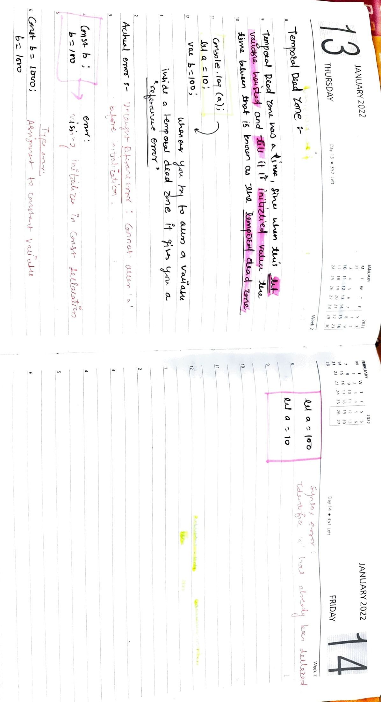
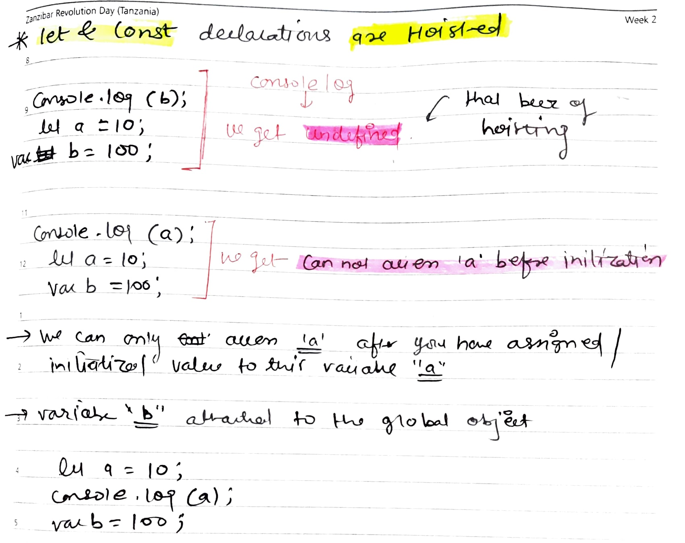

# Temporal Dead Zone , let & const, hoistng

 

### we can refer below : 

 

1. let and const are hoisted but its memory is allocated at ther place than window which cannot be accessed before initialiasation.

2. Temporal dead zone exists until variable is declared and assigned a value.

3. window.variable OR this .variable will not give value of variable defined using let or const.

4. We can not redeclare the same varibale with let/const(even with the var the second time).

5. Const variable declaration and initialization must be done on the same line.

6. There are three types of error :
- Referance Error : Given wher does not have any memory location.

- Type error: Given when we chnage the type that is not supposed to be changed.

- Syntax error: When Proper syantax(way of wrting a statrmrnt is not used).

- Use const whenever possible followed by let, uses var as little possible(only if you have to). It helps avoid error.

- Initializing variables at the top is good idea, helps shrinks the TDZ to zero.